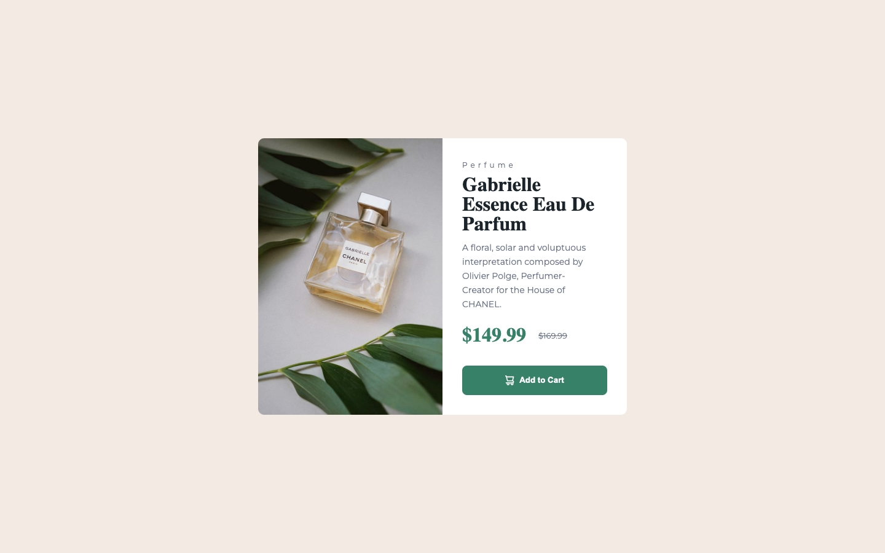

# Frontend Mentor - Product preview card component solution

This is a solution to the [Product preview card component challenge on Frontend Mentor](https://www.frontendmentor.io/challenges/product-preview-card-component-GO7UmttRfa). Frontend Mentor challenges help you improve your coding skills by building realistic projects.

## Table of contents

- [Overview](#overview)
  - [Screenshot](#screenshot)
  - [Links](#links)
  - [Built with](#built-with)
  - [What I learned](#what-i-learned)
  - [Continued development](#continued-development)
  - [Useful resources](#useful-resources)
- [Author](#author)

## Overview

An HTML and CSS Product preview card.

### Screenshot

### Links

- Solution URL: https://www.frontendmentor.io/solutions/an-html-and-css-product-preview-card-component-trH83OQJyL
- Live Site URL: https://product-preview-card-component-sage-three.vercel.app/
- GitHub Repo: https://github.com/ZounMedia/product-preview-card-component

## My process

### Built with

- Semantic HTML5 markup
- CSS
- Flexbox
- Mobile-first workflow

### What I learned

I learned how

### Continued development

I used regular CSS since this compent was not that complex, but I think I should have used SASS for a better development workflow.

### Useful resources

- https://fonts.google.com/specimen/Montserrat - Google Fonts Montserrat url
- https://fonts.google.com/specimen/Fraunces? - Google Fonts Fraunces url

## Author

- Frontend Mentor - https://github.com/ZounMedia
